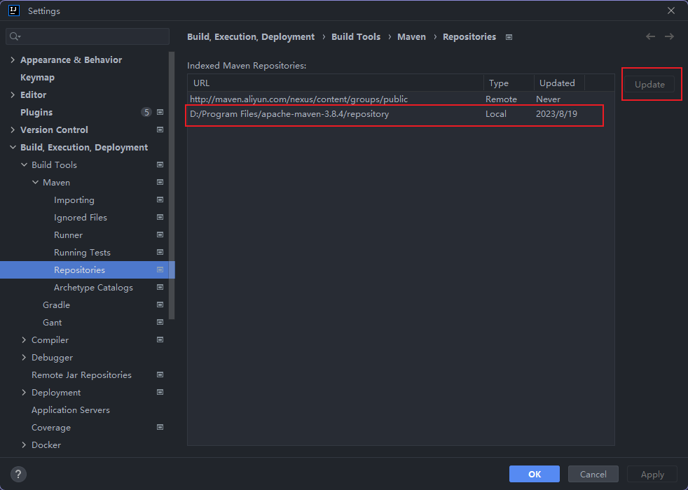

## 问题现象

平时pom文件都可以根据输入的依赖关键词进行依赖引入的补全，但是突然输入关键词后怎样都无法补全

## 问题

可以正常运行Maven项目，说明Maven没问题，所以是IDEA设置的问题

## 分析原因

检查IDEA的Maven相关配置，`Settings -> Build, Execution, Deployment -> Build Tools -> Maven`

最后发现`Settings -> Build, Execution, Deployment -> Build Tools -> Maven -> Repositories`中，Local仓库的Updated状态为error

选择Local仓库后点击旁边的Update按钮，IDEA刷新对本地Maven仓库的索引

