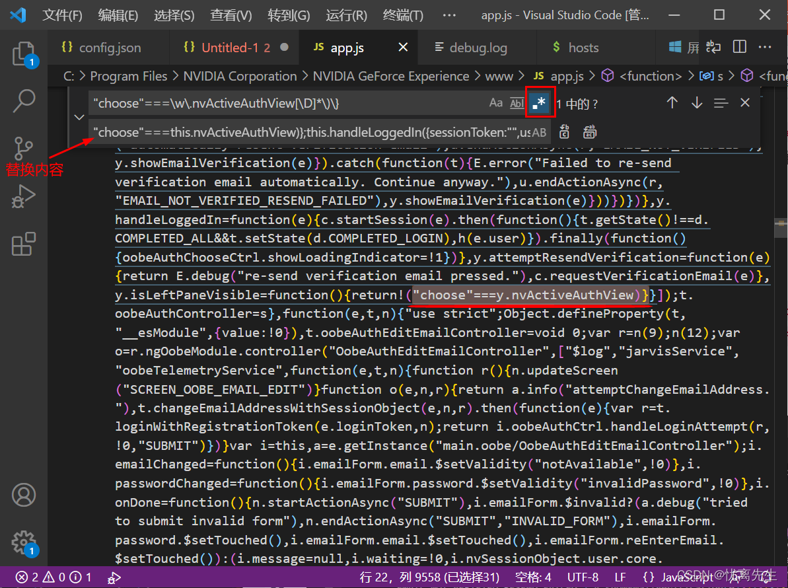
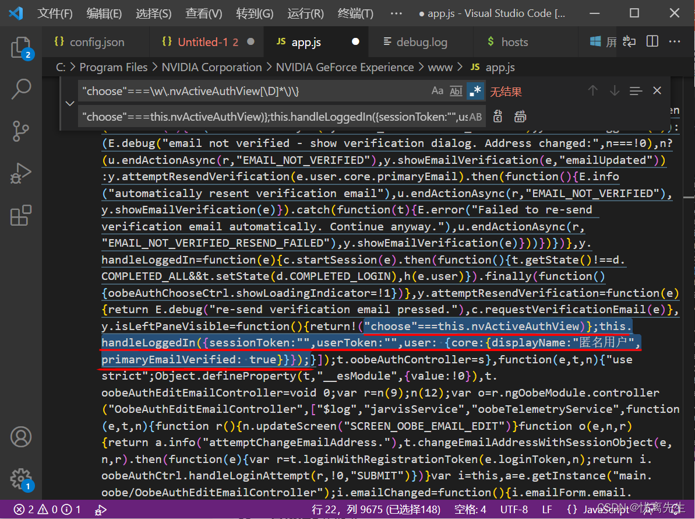

::: tip
3.27.0.112版本成功
:::

1. 使用VS Code(或其它代码编辑器)打开文件`C:\Program Files\NVIDIA Corporation\NVIDIA GeForce Experience\www\app.js`

   > 注意，不要格式化代码！ 本文提供的正则表达式适用于，从未格式化过的代码中搜索关键代码。

2. 使用正则表达式`"choose"===\w\.nvActiveAuthView[\D]*\)\}`搜索代码，其中的`[\D]*`考虑到了兼容GFE旧版本代码的细微变化。
3. 替换内容为 
   `"choose"===this.nvActiveAuthView)};this.handleLoggedIn({sessionToken:"",userToken:"",user: {core:
   {displayName:"匿名用户",primaryEmailVerified: true}}});`
     
   **代码替换前：**

   
   **代码替换后：**

   
