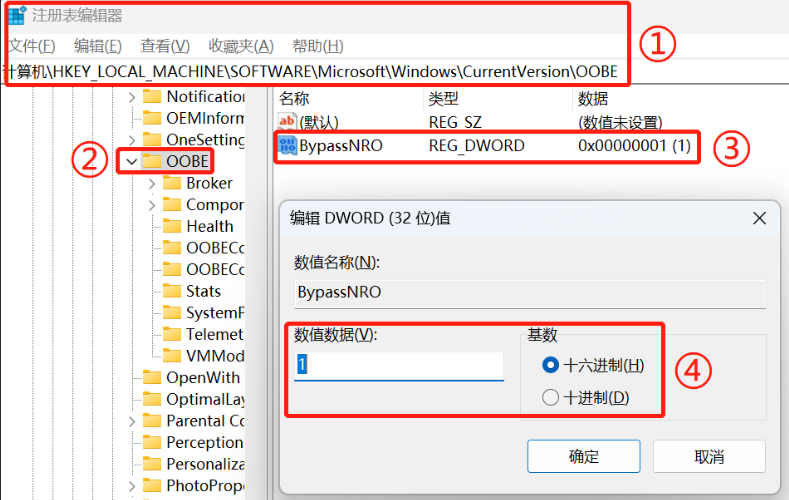

## 方法一：任务管理器关闭网络

1. 按Shift+F10然后（或Fn+Shift+F10），弹出命令提示符窗口，输入taskmgr并回车即可打开系统任务管理器。
2. 在任务管理器里的详细信息找到 `OOBE Network Connection Flow` 进程，选中结束任务。

> 22H2版本无法解决，会提示：糟糕你已断开internet连接，请重试

## 方法二：通过CMD命令跳过Win11联网界面

1. Shift + F10（或者Fn+Shift+F10），打开cmd窗口，输入命令：`oobe\BypassNRO.cmd`
2. 回车执行命令之后，此时Win11电脑就会自动重启，重启之后联网界面就会有一个暂时跳过的选项，可以和以前一样离线配置。

> 22H2版本无法解决，会提示：无法使用命令或提示命令不存在

## 方法三：修改Win11注册表跳过联网界面

1. Shift + F10（或者Fn+Shift+F10），打开cmd窗口，输入命令：regedit
2. 在打开的注册表编辑器界面中，依次打开注册表项：HKEY_LOCAL_MACHINE -> SOFTWARE -> Microsoft -> Windows ->
   CurrentVersion -> OOBE
3. 在注册表的右侧空白处鼠标右键，在弹出的右键菜单项中，选择：新建 -> DWORD (32 位)值(D)。
4. 给新建的值重命名为：BypassNRO，双击打开BypassNRO这个值，然后在编辑 DWORD (32 位)值窗口，将数值数据修改为【1】，再点击【确定】。
   
5. 在cmd窗口再输入命令：`logoff`，回车，即可跳过联网登录账号提示。
