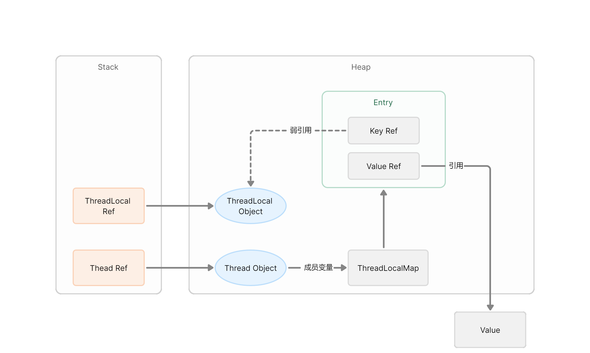

## 作用

ThreadLocal是用来解决java多线程程序中并发问题的一种途径；通过为每一个线程创建一份共享变量的副本来保证各个线程之间的变量的访问和修改互相不影响；

ThreadLocal存放的值是线程内共享的，线程间互斥的，主要用于线程内共享一些数据，避免通过参数来传递，这样处理后，能够优雅的解决一些实际问题。

比如一次用户的页面操作请求，我们可以在最开始的filter中，把用户的信息保存在ThreadLocal中，在同一次请求中，在使用到用户信息，就可以直接到ThreadLocal中获取就可以了。

## 实现原理

查看Thread类，可以看到其内部维护了两个threadlocal，默认值都是null

```java
/*
 * ThreadLocal values pertaining to this thread. This map is maintained
 * by the ThreadLocal class.
 */
ThreadLocal.ThreadLocalMap threadLocals;

/*
 * InheritableThreadLocal values pertaining to this thread. This map is
 * maintained by the InheritableThreadLocal class.
 */
ThreadLocal.ThreadLocalMap inheritableThreadLocals;
```

查看ThreadLocal类，可以看到其有一个内部类ThreadLocalMap，并且该内部类维护了一个数据结构类型为Entry的数组

```java
public class ThreadLocal<T> {
    static class ThreadLocalMap {
        static class Entry extends WeakReference<ThreadLocal<?>> {
        /** The value associated with this ThreadLocal. */
        Object value;
    
        Entry(ThreadLocal<?> k, Object v) {
          super(k);
          value = v;
        }
      }
    }
}
```

从源码中我们可以看到，Entry结构实际上是继承了一个ThreadLocal类型的弱引用并将其作为key，value为Object类型。

对于ThreadLocalMap，有以下这些内部的变量：

```java
/**
 * The initial capacity -- MUST be a power of two.
 */
private static final int INITIAL_CAPACITY = 16;

/**
 * The table, resized as necessary.
 * table.length MUST always be a power of two.
 */
private Entry[] table;

/**
 * The number of entries in the table.
 */
private int size = 0;

/**
 * The next size value at which to resize. 创建了ThreadLocalMap对象后会被重新设置
 */
private int threshold; // Default to 0
```

ThreadLocalMap的构造方法如下所示：

```java
/**
 * Construct a new map initially containing (firstKey, firstValue).
 * ThreadLocalMaps are constructed lazily, so we only create
 * one when we have at least one entry to put in it.
 */
ThreadLocalMap(ThreadLocal<?> firstKey, Object firstValue) {
    // 初始化Entry数组，大小 16
    table = new Entry[INITIAL_CAPACITY];
    // 用第一个键的哈希值对初始大小取模得到索引，和HashMap的位运算代替取模原理一样
    int i = firstKey.threadLocalHashCode & (INITIAL_CAPACITY - 1);
    // 将Entry对象存入数组指定位置
    table[i] = new Entry(firstKey, firstValue);
    size = 1;
    // 初始化扩容阈值，第一次设置为10
    setThreshold(INITIAL_CAPACITY);
}
```

从构造方法的注释中可以了解到，该构造方法是懒加载的，只有当我们创建一个Entry对象并需要放入到Entry数组的时候才会去初始化Entry数组。

## 内存泄露问题

ThreadLocal的引用关系如下：



从上面的图中可以看到，ThreadLocal对象，是有两个引用的，一个是栈上的ThreadLocal引用，一个是ThreadLocalMap中的Key对它的引用。

假如，栈上的ThreadLocal引用不再使用了，即方法结束后这个对象引用就不再用了，那么，就还剩下ThreadLocalMap中的Key对它的引用，所以就会导致他无法被回收，久而久之可能就会对导致OOM。

这就是ThreadLocal的内存泄露问题，为了解决这个问题，ThreadLocalMap使用了弱引用。

### 为什么使用了弱引用还存在内存泄露？

当一个线程调用ThreadLocal的set方法设置变量的时候，当前线程的ThreadLocalMap就会存放一个记录，该记录的key为ThreadLocal的弱引用，value就是通过set设置的值，这个value值被强引用。

这样做可以很大程度上的避免因为ThreadLocal的使用而导致的OOM问题，但是这个问题却无法彻底避免。

因为我们可以看到，虽然key是弱引用，但是value的那条引用，还是个强引用呢！ThreadLocalMap是Thread对象的一个成员变量，当线程被销毁时，ThreadLocalMap才会被销毁，value的引用才会被切断，value才会被GC

那么，什么情况下，Thread会一直在呢？那就是线程池。

在线程池中，**重复利用线程的时候，就会导致这个引用一直在，而value就一直无法被回收**。

那么如何解决呢？

ThreadLocalMap底层使用数组来保存元素，使用“线性探测法”来解决hash冲突的，在每次调用ThreadLocal的get、set、remove等方法的时候，内部会实际调用ThreadLocalMap的get、set、remove等操作。

而ThreadLocalMap的每次get、set、remove，都会清理过期的Entry。

所以，**当我们在一个ThreadLocal用完之后，手动调用一下remove**，就可以在下一次GC的时候，把Entry清理掉。


