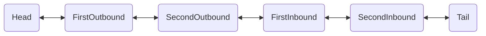

## ChannelPipeline

ChannelPipeline类是ChannelHandler实例对象的链表，用于处理或截获通道的接收和发送数据。它提供了一种高级的截取过滤模式（类似Servlet中的filter功能），让用户可以在ChannelPipeline中完全控制一个事件以及如何处理ChannelHandler与ChannelPipeline的交互。

对于每个新的通道Channel，都会创建一个新的ChannelPipeline

**下面是一个ChannelPipeline示意图：**



> Head和Tail是源码内使用的两个特殊节点

代码相当于：

```java
pipeline.addLast(new FirstOutbound());
pipeline.addLast(new SecondOutbound());
pipeline.addLast(new FirstInbound());
pipeline.addLast(new SecondInbound());
```

Channel会从Head节点进入，经过一系列入站（Inbound）处理器后到达Tail节点，Tail节点再向前寻找出站处理器（Outbound）进行处理，直到Head节点，再写出数据


