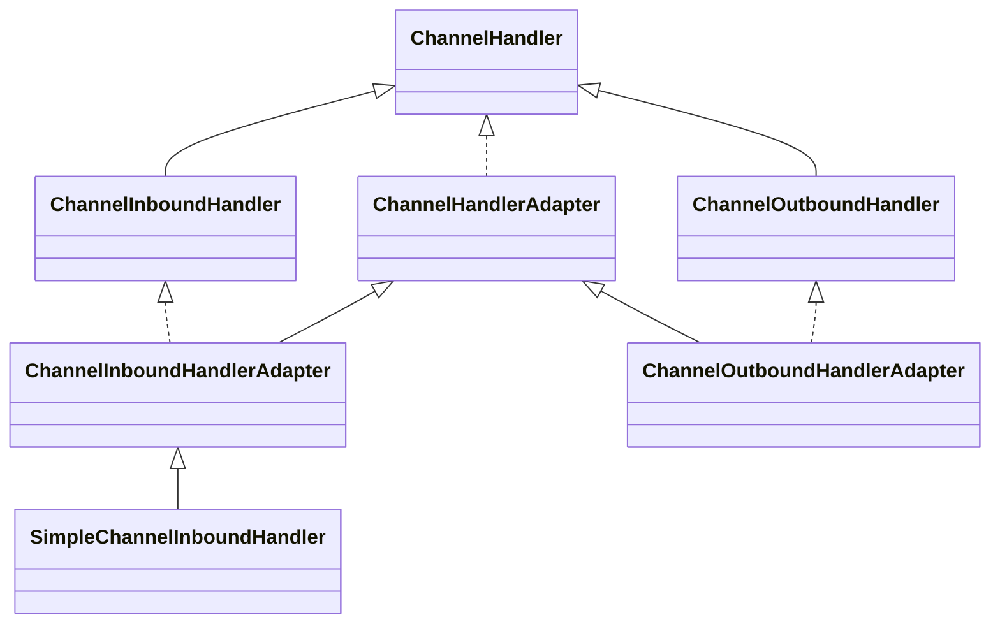

## ChannelInbound/OutboundHandler关系



**实现自定义处理器：**

自定义Inbound入站处理器：

1. 继承`ChannelInboundHandlerAdapter`
2. 继承`SimpleChannelInboundHandler`

自定义Outbound入站处理器：

1. 继承`ChannelOutboundHandlerAdapter`

### 适配器模式

为什么实现自定义Handler时不直接实现ChannelInboundHandler、ChannelOutboundHandler接口，而是继承两者的适配器呢？

因为接口中有很多默认方法需要实现，所以这里就采用了适配器模式。适配器内部对ChannelInboundHandler、ChannelOutboundHandler接口方法做了默认的实现，所以当使用适配器时，只需要重写想要处理的方法就行，不需要实现ChannelInboundHandler、ChannelOutboundHandler接口内的所有方法

## SimpleChannelInboundHandler

SimpleChannelInboundHandler 继承自 ChannelInboundHandlerAdapter，并提供了更方便的消息处理方式。

相比ChannelInboundHandlerAdapter，有以下几个优点：

1. **泛型支持：** SimpleChannelInboundHandler 是一个泛型类，可以指定处理的消息类型。这样，在处理消息时，不需要进行类型转换，可以直接获取到正确的消息类型，并进行相应的处理。
2. **消息自动释放：** SimpleChannelInboundHandler 在处理完消息后，会ReferenceCountUtil.release自动释放消息对象。这减少了手动释放消息的工作量，避免了内存泄漏的风险。

### Read方法对比

**SimpleChannelInboundHandler的Read：**

```java
protected void channelRead0(ChannelHandlerContext ctx, String msg)
```

**ChannelInboundHandlerAdapter的Read：**

```java
public void channelRead(ChannelHandlerContext ctx, Object msg)
```

可以看出，SimpleChannelInboundHandler的Read方法msg是带有类型的，不需要再进行类型转换了

### 注意事项

虽然SimpleChannelInboundHandler进行了类型转换，但是看源码就知道，它是强转的，也就是说，如果接收到的数据与定义在泛型的类型原本就不一样，是转换不了的

所以，**使用SimpleChannelInboundHandler自定义Handler时，仍然要这Handler之前添加decoder到ChannelPipeline**，否则可能无法正常收到数据

