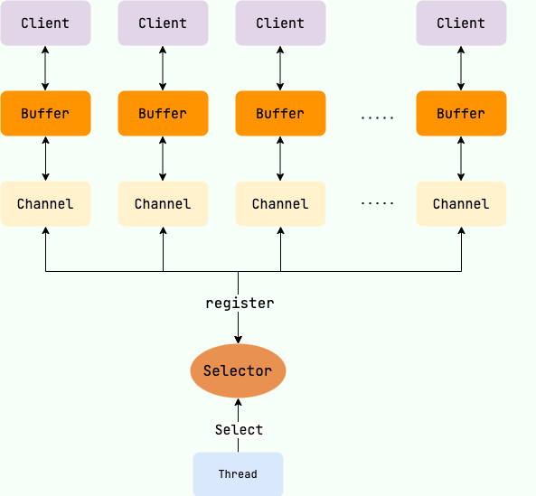

## NIO核心组件

**NIO 主要包括以下三个核心组件**：

- **Buffer（缓冲区）**：NIO 读写数据都是通过缓冲区进行操作的。读操作的时候将 Channel 中的数据填充到
  Buffer中，而写操作时将 Buffer中的数据写入到 Channel 中。
- **Channel（通道）**：Channel 是一个双向的、可读可写的数据传输通道，NIO
  通过Channel来实现数据的输入输出。通道是一个抽象的概念，它可以代表文件、套接字或者其他数据源之间的连接。
- **Selector（选择器）**：允许一个线程处理多个
  Channel，基于事件驱动的 I/O 多路复用模型。所有的 Channel 都可以注册到Selector上，由Selector来分配线程来处理事件。

## Netty

Netty是基于Java NIO实现的网络应用框架。

Netty的核心IO模型是异步非阻塞的,这是建立在Java NIO的非阻塞IO基础之上的。相比于传统的BIO同步阻塞模型,NIO可以大大提高网络应用的性能和扩展能力。

Netty对Java NIO进行了抽象和封装,实现了Reactor模式来做到异步非阻塞,其主要基于Java NIO的抽象有:

- 使用Java NIO的Channel、Selector、ByteBuffer等作为异步IO的基础。
- 基于Java NIO的SocketChannel实现了异步客户端和服务端。
- 通过ByteBuf抽象了虚拟缓存区,用于高效处理字节数据。
- 用Pipeline、ChannelHandler等实现了拦截过滤链模式。
- 基于Selector实现了异步非阻塞的事件驱动模型。
- 提供了各种协议的编解码器和框架。
- 简化和扩展了线程模型的使用。

综上,Netty对Java NIO的抽象使其更易于使用,并构建了一个灵活强大的异步网络应用框架。所以可以说Netty是基于Java
NIO之上进行模块化设计实现的。

## Reactor模型

Reactor 模型是一种设计模式,用于构建高并发和高性能的网络服务器。

Reactor 模型的核心是事件驱动，使用非阻塞IO实现事件驱动架构, 通过事件与处理分离、队列传递消息实现高并发。
正是因为事件驱动,Reactor才能高效地响应大量客户端、实现高性能服务器。

**应用案例**：

- Nginx
- Tomcat
- Node.js
- Kafka

### Reactor模型——主从多线程模型（父子多线程模型）

主从Reactor 模式中，分为主 Reactor 和 从 Reactor，分别处理 新建立的连接、IO读写事件/事件分发

**主Reactor**：只负责接受新连接，不做具体的数据处理。

**从Reactor**：负责处理连接的所有读写和数据操作。

- 主Reactor 只关注接受新连接,处理简单,效率高。可以解决同一时间大量新连接
- 从Reactor 处理比接收新连接复杂得多的读写和业务,可以支撑很多连接。
- 主从多线程模型由多个 Reactor 线程组成，每个 Reactor 线程都有独立的 Selector 对象。MainReactor 仅负责处理客户端连接的
  Accept 事件，连接建立成功后将新创建的连接对象注册至 SubReactor。再由 SubReactor 分配线程池中的 I/O
  线程与其连接绑定，它将负责连接生命周期内所有的 I/O 事件。

