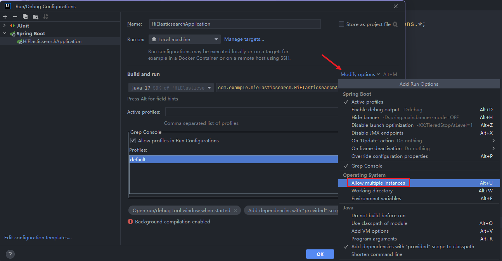

## 多实例运行

什么是多实例运行？其实就是同样的代码运行两个单独的程序或服务。

IDEA开启程序多实例运行的操作如下：

> 注意：如果IDEA版本在2021以前，该配置称为`Allow parallel run`

### SpringBoot项目

如果是SpringBoot项目的话，开启后直接运行一般会出现端口已占用的异常而导致启动失败

解决方法也很简单，在VM options指定端口`-Dserver.port=9090`
