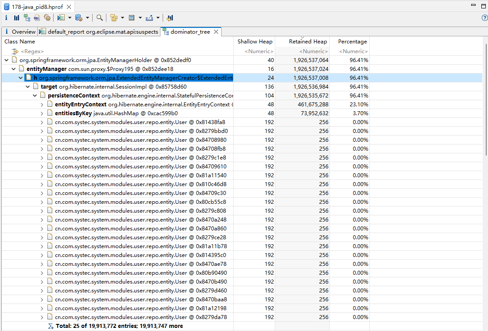

## 背景

**JDK版本：** `13`

**JPA的版本：** `org.springframework.boot:spring-boot-starter-data-jpa:3.1.5`

用户数量有130万左右，每天相隔4个小时会进行增量同步用户数据，每日凌晨定时全量同步用户数据

## 问题现象

在凌晨进行全量同步用户数据时发生OOM

## 可能原因

一次加载的用户数据对象太多，撑爆堆内存了？

## 原因分析

一开始以为是一次加载的用户数据对象太多，导致撑爆堆内存了

查看业务代码后发现，每次都是拉一小批用户进行处理的，每批500，并且使用完后没有其他地方引用，不影响GC回收，堆应该不会爆

### hprof分析

因为配置了`-XX:+HeapDumpOnOutOfMemoryError`，所以有dump出来的hprof文件，用Eclipse Memory Analyzer打开hprof文件

发现`org.springframework.orm.jpa.EntityManagerHolder`类，它的实例占用了堆内存的96%

在它里面，可以发现非常多的`cn.com.systec.system.modules.user.repo.entity.User`
，说明这些User对象一直在内存中，没有GC掉，但是很奇怪的是为什么这些User会在EntityManagerHolder里

去查阅JPA相关资料发现，这和JPA的一级缓存有关

### JPA一级缓存

JPA的默认缓存机制是一级缓存（first-level caching），旨在提高性能。然而，在某些情况下，查询结果不是最新的数据库值。这是因为在同一事务中多次调用相同的查询时，Spring
Data JPA会返回缓存中的结果，而不是直接访问数据库。

上面查询的User对象数据会缓存到JPA中，这些被JPA管理的User对象不会被GC，当JPA的一次Session处理的数据很多时，缓存的量也就越大，可能就会发生OOM

## 问题原因

每次查询用户数据时，JPA会缓存查询数据，当同步用户数量多时，缓存的对象过多会导致堆内存不足，发生OOM

## 解决方法

* 调大JVM堆内存
* JPA每次处理一批数据后，若之后没有很多地方使用这些数据的话，可以清除掉JPA的缓存。注入EntityManager的Bean，
  然后使用`EntityManager.clear`来清除缓存
